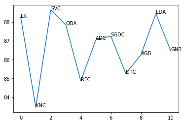

# Automatic Stance Detection


The issue of “fake news” has arisen recently as a potential threat to high-quality
journalism and well-informed public discourse.In this project we are performing
`stance detection` -- i.e. identifying whether a particular news headline `agrees`
with, `disagrees` with, `discusses`, or is `unrelated` to a particular news article -- in
order to allow journalists and others to more easily find and investigate possible
instances of **fake news**.

## Problem Statement

The problem is about “stance detection,” which involves comparing a headline with a body of text
from a news article to determine what relationship (if any) existsbetween the two. There are 4
possible classifications:
* The article text `agrees` with the headline.  
* The article text `disagrees` with the headline.  
* The article text is a `discussion` of the headline, without taking a position on it.  
* The article text is `unrelated` to the headline (i.e. it doesn’t address the same topic).  


The above problem is based on the **[Fake News Challenge](http://www.fakenewschallenge.org/)** and is based on this research **[paper](https://web.stanford.edu/class/archive/cs/cs224n/cs224n.1174/reports/2760230.pdf)**.

## Prerequisites
Download the dataset required from **[Fake News Challenge DataSet](https://github.com/FakeNewsChallenge/fnc-1)**
and put in data folder located in the home folder  

Download the Pretrained GLove word embeddings from here **[Glove Word embeddings](https://www.kaggle.com/rtatman/glove-global-vectors-for-word-representation#glove.6B.50d.txt)**

Add the above glove word50.txt file in the data folder

For knowing more about the dataset used go **[here](https://github.com/Abhinav1004/Fake-News-Stance-Detection/blob/master/data/AbouttheDataset.md)**

## Modelling Techniques
Our goal in approaching the stance detection problem was to experiment with a wide range of the machine learning Algorithms namely.
```

* Linear regression  
* Logistic regression  
* K Nearest Neighbour  
* Support Vector Machine  
* Qudratic Discriminant Analysis  
* Random Forest  
* Adaboost  
* SGD Classifier  
* Decision Tree  
* XG Boost  
* Linear Discriminant Analysis  
* Gaussian Naive Bayes  

```


## Problem approach
1. First after loading the data in the form of csv format,we will perform
Data Cleaning practises and remove all the stop words,do
stemming,and all the unwanted symbols from the text data.
2. Then we tokenize the text which represents the text into set of words
or tokens and represent the whole sentence as a whole.
3. We preprocess the data so as to be used by different word
embedding techniques   
4. We perform the feature engineering on our preprocessed data and
extract three features from it namely   
      1. Word vectorization to find the similarity between the two set of
          text.   
      2. KL Divergence method of finding the divergence between the
          words.   
      3. N gram overlap method of finding the number of occurence of
        the words in the sentence so as to determine the weight of the
        word in the text.   
5. We pass the vectored method through the pretrained word embedding
vector called Glove Word embeddings which has been trained on the
massive data set from the wikipedia and get the corresponding numerical
weight for a particular word.   


Please find the implementation **[here](/Stance_Detection.ipynb)**.

## Programming Tools   
### Language :*Python3*  
## Associated Libraries:*Pandas,SciPy,Numpy,TensorFlow,Keras*.  


## Results

We got the best accuracy of 88.8% with Support Vector Machine Classifier



## Improvements

Working on the different architectures of RNN and other algorithms for features extraction.

Please see the **[link](https://github.com/stance-detection)** for two more approaches used to solve the above problem.
